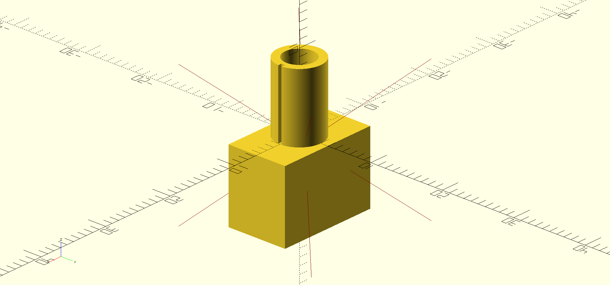

# toggle-switches
An OpenSCAD library to draw toggle switches.

.

## Installation
Add a git submodule to your project:

```sh
git submodule add https://github.com/mmalecki/openscad-toggle-switches toggle-switches
```

## Usage
```openscad
use <toggle-switches/toggle-switches.scad>;
mts_toggle_switch();
```

## API

### `mts_toggle_switch(columns = 1)`
Draws a MTS switch with `columns` columns.
